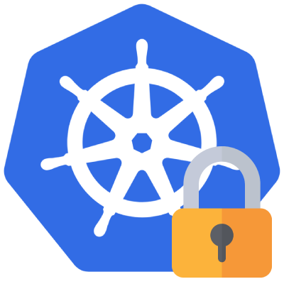

# Kubernetes read-only MCP server

[](https://github.com/patrickdappollonio/mcp-kubernetes-ro/releases)

 `mcp-kubernetes-ro` is a [Model Context Protocol (MCP)](https://modelcontextprotocol.io/introduction) server providing read-only access to Kubernetes clusters for AI assistants. It enables AI models to list resources, get resource details, retrieve pod logs, discover API resources, and perform base64 encoding/decoding operations - all while maintaining security through read-only access.

The server leverages your local `kubectl` configuration (even when `kubectl` is not required to be installed) and provides a safe, read-only interface to your Kubernetes clusters, preventing any destructive operations while allowing comprehensive cluster inspection and troubleshooting capabilities.

## Features

- **Does not require `kubectl`**: The MCP server uses your local `kubectl` configuration to connect to your Kubernetes cluster but not the binary, so it works even when `kubectl` is not installed on your machine.
- **Resource Listing**: List any Kubernetes resources by type with optional filtering by labels, fields, and namespaces
- **Resource Details**: Get complete details for specific Kubernetes resources
- **Pod Logs**: Retrieve pod logs with advanced filtering options including grep patterns, time filtering, and previous logs
- **Container Discovery**: List containers within pods for targeted log access
- **API Discovery**: Discover available Kubernetes API resources and their capabilities
- **Base64 Utilities**: Encode and decode base64 data for Kubernetes secrets and configurations
- **Multiple Transport Modes**: Support for both stdio and Server-Sent Events (SSE) communication
- **Read-Only Security**: Complete prevention of destructive operations while maintaining full inspection capabilities
- **Namespace Support**: Work with specific namespaces or cluster-wide resources
- **Advanced Filtering**: Support for label selectors, field selectors, and pagination
- **Per-Command Context**: Specify different Kubernetes contexts for individual commands
- **Environment Variable Support**: Automatic detection of KUBECONFIG environment variable
- **Startup Connectivity Check**: Automatic validation of cluster connectivity and basic permissions on startup

## Installation

Feel free to grab a pre-built binary from the [releases page](https://github.com/patrickdappollonio/mcp-kubernetes-ro/releases).

Alternatively, you can use Homebrew in macOS or Linux to install it:

```bash
brew install patrickdappollonio/tap/mcp-kubernetes-ro
```

You can also use it as an NPM package: just make sure the configuration is given to your AI agent:

```bash
npx -y @patrickdappollonio/mcp-kubernetes-ro
```

Finally, Docker users can use the prebuilt image from the GitHub Container Registry:

```bash
docker pull ghcr.io/patrickdappollonio/mcp-kubernetes-ro:latest
```

### Editor Configuration

Add the following configuration to your editor's settings to use `mcp-kubernetes-ro`:

```json5
{
  "mcpServers": {
    "kubernetes-ro": {
      "command": "mcp-kubernetes-ro",
      "args": [
        // Uncomment and modify as needed:
        // "--kubeconfig=/path/to/kubeconfig",
        // "--namespace=default",
        // "--transport=stdio",
        // "--port=8080",
        // "--disabled-tools=get_logs,decode_base64"
      ],
      "env": {
        // Set KUBECONFIG environment variable if needed:
        // "KUBECONFIG": "/path/to/kubeconfig",
        // Set MCP_KUBERNETES_RO_DISABLED_TOOLS environment variable if needed:
        // "MCP_KUBERNETES_RO_DISABLED_TOOLS": "get_logs,decode_base64",
        // Or use generic DISABLED_TOOLS environment variable:
        // "DISABLED_TOOLS": "get_logs,decode_base64"
      }
    }
  }
}
```

You can use `mcp-kubernetes-ro` directly from your `$PATH` as shown above, or provide the full path to the binary (e.g., `/path/to/mcp-kubernetes-ro`).

You can also simplify the installation process by using it as an `npx` package:

```json5
{
  "mcpServers": {
    "kubernetes-ro": {
      "command": "npx",
      "args": [
        "-y",
        "@patrickdappollonio/mcp-kubernetes-ro"
        // Uncomment and modify as needed:
        // "--kubeconfig=/path/to/kubeconfig",
        // "--namespace=default",
        // "--transport=stdio",
        // "--port=8080",
        // "--disabled-tools=get_logs,decode_base64"
      ],
      "env": {
        // Set KUBECONFIG environment variable if needed:
        // "KUBECONFIG": "/path/to/kubeconfig",
        // Set MCP_KUBERNETES_RO_DISABLED_TOOLS environment variable if needed:
        // "MCP_KUBERNETES_RO_DISABLED_TOOLS": "get_logs,decode_base64",
        // Or use generic DISABLED_TOOLS environment variable:
        // "DISABLED_TOOLS": "get_logs,decode_base64"
      }
    }
  }
}
```

And this is how to leverage the Docker image instead:

```json5
{
  "mcpServers": {
    "kubernetes-ro": {
      "command": "docker",
      "args": [
        "run",
        "-i",
        "--rm",
        "-e", "KUBECONFIG=/root/.kube/config",
        "-v", "/path/to/kubeconfig:/root/.kube/config",
        "ghcr.io/patrickdappollonio/mcp-kubernetes-ro"
        // Place additional flags here, like --disabled-tools=get_logs,decode_base64
      ],
      "env": {
        // Set KUBECONFIG environment variable if needed:
        // "KUBECONFIG": "/path/to/kubeconfig",
        // Set MCP_KUBERNETES_RO_DISABLED_TOOLS environment variable if needed:
        // "MCP_KUBERNETES_RO_DISABLED_TOOLS": "get_logs,decode_base64",
        // Or use generic DISABLED_TOOLS environment variable:
        // "DISABLED_TOOLS": "get_logs,decode_base64"
      }
    },
  }
}
```

Do note that you'll need to mount your kubeconfig file into the container, and either set the `KUBECONFIG` environment variable to the path of the mounted file, or use the `--kubeconfig` flag to set it.

### Prerequisites

- A valid Kubernetes configuration file (typically `~/.kube/config`)
- Valid credentials and cluster access (kubectl binary is not required)
- Appropriate RBAC permissions for read operations
- **Metrics Server** (required for metrics tools): For metrics functionality (`get_node_metrics`, `get_pod_metrics`), the metrics-server must be installed in your cluster. If not available, these tools will return an error message.

## Available MCP Tools

There are **10 tools** available:

- **`list_resources`**: List any Kubernetes resources by type with optional filtering, sorted newest first
- **`get_resource`**: Get specific resource details
- **`get_logs`**: Get pod logs with advanced filtering options including grep patterns, time filtering, and previous logs
- **`get_pod_containers`**: List containers in a pod for log access
- **`list_api_resources`**: List available Kubernetes API resources with their details (similar to kubectl api-resources)
- **`list_contexts`**: List available Kubernetes contexts from the kubeconfig file
- **`get_node_metrics`**: Get node metrics (CPU and memory usage)
- **`get_pod_metrics`**: Get pod metrics (CPU and memory usage)
- **`encode_base64`**: Encode text data to base64 format
- **`decode_base64`**: Decode base64 data to text format

## Tool Management

### Disabling Tools

You can disable specific tools using either the `--disabled-tools` command line flag or environment variables with a comma-separated list of tool names. Two environment variables are supported to accommodate different use cases:

- **`MCP_KUBERNETES_RO_DISABLED_TOOLS`**: App-specific variable that won't conflict with other tools
- **`DISABLED_TOOLS`**: Generic variable that can be shared across multiple tools in your environment

**Priority order**:
1. **Command line flag**: `--disabled-tools=NAMES` (highest priority)
2. **App-specific environment variable**: `MCP_KUBERNETES_RO_DISABLED_TOOLS`
3. **Generic environment variable**: `DISABLED_TOOLS`

This is useful for:

- **Security**: Disable tools that might expose sensitive information (e.g., `get_logs`, `decode_base64`)
- **Performance**: Disable resource-intensive tools when not needed (e.g., `get_node_metrics`, `get_pod_metrics`)
- **Environment-specific**: Disable tools that aren't available in your cluster (e.g., metrics tools when metrics server is not installed)
- **Compliance**: Restrict functionality to meet organizational policies

**Available tool names for disabling:**
- `list_resources`
- `get_resource`
- `get_logs`
- `get_pod_containers`
- `list_api_resources`
- `list_contexts`
- `get_node_metrics`
- `get_pod_metrics`
- `encode_base64`
- `decode_base64`

When a tool is disabled, it will not be registered with the MCP server and will not appear in the available tools list. A message will be logged to stderr indicating which tools have been skipped.

**Examples:**
```bash
# Using command line flag (highest priority)
mcp-kubernetes-ro --disabled-tools=encode_base64,decode_base64,get_logs

# Using app-specific environment variable
export MCP_KUBERNETES_RO_DISABLED_TOOLS=encode_base64,decode_base64,get_logs
mcp-kubernetes-ro

# Using generic environment variable
export DISABLED_TOOLS=encode_base64,decode_base64,get_logs
mcp-kubernetes-ro

# Priority demonstration: command line flag overrides environment variables
export MCP_KUBERNETES_RO_DISABLED_TOOLS=get_logs
export DISABLED_TOOLS=get_pod_metrics
mcp-kubernetes-ro --disabled-tools=encode_base64,decode_base64

# Priority demonstration: app-specific env var overrides generic env var
export MCP_KUBERNETES_RO_DISABLED_TOOLS=encode_base64,decode_base64
export DISABLED_TOOLS=get_logs,get_pod_metrics
mcp-kubernetes-ro

# Output: Skipping disabled tool: "encode_base64"
# Output: Skipping disabled tool: "decode_base64"
```

## Running Modes

### Standard (stdio) Mode

By default, `mcp-kubernetes-ro` runs in stdio mode, which is suitable for integration with editors and other tools that communicate via standard input/output.

```bash
mcp-kubernetes-ro
```

### Server-Sent Events (SSE) Mode

Alternatively, you can run `mcp-kubernetes-ro` as an HTTP server with SSE support for web-based integrations:

```bash
mcp-kubernetes-ro --transport=sse --port=8080
```

In SSE mode, the server will listen on the specified port (default: 8080) and provide the same MCP tools over HTTP using Server-Sent Events. This is useful for web applications or environments where stdio communication isn't practical.

## Configuration Options

The following command-line flags are available to configure the MCP server:

### Kubernetes Configuration
- `--kubeconfig=PATH`: Path to kubeconfig file (defaults to `KUBECONFIG` environment variable, then `~/.kube/config`)
- `--namespace=NAME`: Default namespace for operations (defaults to current namespace)

### Transport Options
- `--transport=TYPE`: Transport type: `stdio` or `sse` (default: `stdio`)
- `--port=PORT`: Port for SSE server (default: 8080, only used with `--transport=sse`)

### Tool Management
- `--disabled-tools=NAMES`: Comma-separated list of tool names to disable (optional)
- `MCP_KUBERNETES_RO_DISABLED_TOOLS`: App-specific environment variable for disabled tools (command line flag takes priority)
- `DISABLED_TOOLS`: Generic environment variable for disabled tools (lower priority than `MCP_KUBERNETES_RO_DISABLED_TOOLS`)

### Context Configuration

The server supports per-command context. This provides more flexibility when working with multiple Kubernetes clusters or contexts within the same `$KUBECONFIG` file.

**Configuration Priority:**
1. **Command-level context**: Use the `context` parameter in individual tool calls
2. **Kubeconfig default**: Use the current context specified in your kubeconfig file

**Kubeconfig Resolution Priority:**
1. **Command-line flag**: `--kubeconfig` parameter
2. **Environment variable**: `KUBECONFIG` environment variable
3. **Default path**: `~/.kube/config`
4. **In-cluster config**: Automatic detection when running inside a Kubernetes pod

**Examples:**
```json
{
  "resource_type": "pods",
  "namespace": "default",
  "context": "production-cluster"
}
```

This approach allows you to:
- Use different contexts for different operations in the same session
- Switch contexts per command without restarting the server
- Maintain compatibility with existing kubeconfig setups

## Tool Usage Documentation

### List Resources

Lists any Kubernetes resources by type with optional filtering, sorted newest first.

**Arguments:**
- `resource_type` (required): The type of resource to list - use plural form (e.g., 'pods', 'deployments', 'services')
- `api_version` (optional): API version for the resource (e.g., 'v1', 'apps/v1')
- `namespace` (optional): Target namespace (leave empty for cluster-scoped resources)
- `context` (optional): Kubernetes context to use (defaults to current context from kubeconfig)
- `label_selector` (optional): Label selector to filter resources (e.g., 'app=nginx,version=1.0')
- `field_selector` (optional): Field selector to filter resources (e.g., 'status.phase=Running')
- `limit` (optional): Maximum number of resources to return (defaults to all)
- `continue` (optional): Continue token for pagination (from previous response)

**Example:**
```json
{
  "resource_type": "pods",
  "namespace": "default",
  "context": "production",
  "label_selector": "app=nginx"
}
```

### Get Resource

Gets specific resource details with complete configuration.

**Arguments:**
- `resource_type` (required): The type of resource to get
- `name` (required): Resource name
- `api_version` (optional): API version for the resource (e.g., 'v1', 'apps/v1')
- `namespace` (optional): Target namespace (required for namespaced resources)
- `context` (optional): Kubernetes context to use (defaults to current context from kubeconfig)

**Example:**
```json
{
  "resource_type": "deployment",
  "name": "nginx-deployment",
  "namespace": "default",
  "context": "production"
}
```

### Get Logs

Gets pod logs with advanced filtering options including grep patterns, time filtering, and previous logs.

**Arguments:**
- `namespace` (required): Pod namespace
- `name` (required): Pod name
- `container` (optional): Container name (required for multi-container pods)
- `context` (optional): Kubernetes context to use (defaults to current context from kubeconfig)
- `max_lines` (optional): Maximum number of lines to retrieve
- `grep_include` (optional): Include only lines matching these patterns (comma-separated). Works like grep - includes lines containing any of these patterns
- `grep_exclude` (optional): Exclude lines matching these patterns (comma-separated). Works like grep -v - excludes lines containing any of these patterns
- `use_regex` (optional): Whether to treat grep patterns as regular expressions instead of literal strings
- `since` (optional): Return logs newer than this time. Supports durations like "5m", "1h", "2h30m", "1d" or absolute times like "2023-01-01T10:00:00Z"
- `previous` (optional): Return logs from the previous terminated container instance (like kubectl logs --previous)

**Example:**
```json
{
  "namespace": "default",
  "name": "nginx-pod-12345",
  "container": "nginx",
  "context": "production",
  "max_lines": "100",
  "grep_include": "error,warning",
  "since": "5m"
}
```

### Get Pod Containers

Lists containers in a pod for log access.

**Arguments:**
- `namespace` (required): Pod namespace
- `name` (required): Pod name
- `context` (optional): Kubernetes context to use (defaults to current context from kubeconfig)

**Example:**
```json
{
  "namespace": "default",
  "name": "nginx-pod-12345",
  "context": "production"
}
```

### List API Resources

Lists available Kubernetes API resources with their details (similar to kubectl api-resources).

**Arguments:**
- None required

**Example:**
```json
{}
```

### List Contexts

Lists available Kubernetes contexts from the kubeconfig file. This is useful for discovering what contexts are available for use with the `context` parameter in other tools.

**Arguments:**
- None required

**Example:**
```json
{}
```

**Example Response:**
```json
{
  "contexts": [
    {
      "name": "production",
      "cluster": "prod-cluster",
      "user": "prod-user",
      "namespace": "default",
      "current": true
    },
    {
      "name": "staging",
      "cluster": "staging-cluster",
      "user": "staging-user",
      "namespace": "staging",
      "current": false
    }
  ],
  "count": 2
}
```

### Get Node Metrics

Gets node metrics (CPU and memory usage) from the metrics server. Results are sorted by timestamp (newest first) for consistent ordering and pagination, since the built-in metrics server endpoint does not support needle-based pagination.

**Arguments:**
- `node_name` (optional): Specific node name to get metrics for. If not provided, returns metrics for all nodes.
- `context` (optional): Kubernetes context to use (defaults to current context from kubeconfig)
- `limit` (optional): Maximum number of node metrics to return. If not provided, returns all available metrics.
- `continue` (optional): Continue token for pagination (from previous response).

**Error Handling:**
- If the metrics server is not available, returns an error message
- Detects common metrics server errors and provides specific guidance

**Example:**
```json
{
  "node_name": "worker-node-1",
  "context": "production",
  "limit": 5
}
```

**Example Response (Single Node):**
```json
{
  "kind": "NodeMetrics",
  "apiVersion": "metrics.k8s.io/v1beta1",
  "metadata": {
    "name": "worker-node-1",
    "creationTimestamp": "2023-01-01T12:00:00Z"
  },
  "timestamp": "2023-01-01T12:00:00Z",
  "window": "10.062s",
  "usage": {
    "cpu": "137m",
    "memory": "1368128Ki"
  }
}
```

**Example Response (List with Pagination):**
```json
{
  "kind": "NodeMetricsList",
  "apiVersion": "metrics.k8s.io/v1beta1",
  "count": 5,
  "items": [
    {
      "kind": "NodeMetrics",
      "metadata": { "name": "node-1" },
      "timestamp": "2023-01-01T12:00:00Z",
      "usage": { "cpu": "137m", "memory": "1368128Ki" }
    }
  ],
  "continue": "eyJvZmZzZXQiOjUsInR5cGUiOiJub2RlIiwibmFtZXNwYWNlIjoiIn0="
}
```

### Get Pod Metrics

Gets pod metrics (CPU and memory usage) from the metrics server. Results are sorted by timestamp (newest first) for consistent ordering and pagination, since the built-in metrics server endpoint does not support needle-based pagination.

**Arguments:**
- `namespace` (optional): Namespace to get pod metrics from. If not provided, returns metrics for all pods in all namespaces.
- `pod_name` (optional): Specific pod name to get metrics for. Requires `namespace` if specified.
- `context` (optional): Kubernetes context to use (defaults to current context from kubeconfig)
- `limit` (optional): Maximum number of pod metrics to return. If not provided, returns all available metrics.
- `continue` (optional): Continue token for pagination (from previous response).

**Error Handling:**
- If the metrics server is not available, returns an error message
- Detects common metrics server errors and provides specific guidance
- Validates that `namespace` is provided when `pod_name` is specified

**Pagination Notes:**
- Continue tokens are context-aware and reset if the namespace context changes
- Client-side pagination is implemented for consistent ordering and filtering

**Example (Specific Pod):**
```json
{
  "namespace": "kube-system",
  "pod_name": "metrics-server-557ff575fb-9dcl4",
  "context": "production"
}
```

**Example (With Pagination):**
```json
{
  "namespace": "kube-system",
  "context": "production",
  "limit": 10,
  "continue": "eyJvZmZzZXQiOjEwLCJ0eXBlIjoicG9kIiwibmFtZXNwYWNlIjoia3ViZS1zeXN0ZW0ifQ=="
}
```

**Example Response (Single Pod):**
```json
{
  "kind": "PodMetrics",
  "apiVersion": "metrics.k8s.io/v1beta1",
  "metadata": {
    "name": "metrics-server-557ff575fb-9dcl4",
    "namespace": "kube-system",
    "creationTimestamp": "2023-01-01T12:00:00Z"
  },
  "timestamp": "2023-01-01T12:00:00Z",
  "window": "18.888s",
  "containers": [
    {
      "name": "metrics-server",
      "usage": {
        "cpu": "8020419n",
        "memory": "48164Ki"
      }
    }
  ]
}
```

**Example Response (List with Pagination):**
```json
{
  "kind": "PodMetricsList",
  "apiVersion": "metrics.k8s.io/v1beta1",
  "namespace": "kube-system",
  "count": 10,
  "items": [
    {
      "kind": "PodMetrics",
      "metadata": { "name": "pod-1", "namespace": "kube-system" },
      "timestamp": "2023-01-01T12:00:00Z",
      "containers": [
        {
          "name": "container-1",
          "usage": { "cpu": "8020419n", "memory": "48164Ki" }
        }
      ]
    }
  ],
  "continue": "eyJvZmZzZXQiOjIwLCJ0eXBlIjoicG9kIiwibmFtZXNwYWNlIjoia3ViZS1zeXN0ZW0ifQ=="
}
```

### Encode Base64

Encodes text data to base64 format.

**Arguments:**
- `data` (required): Text data to encode

**Example:**
```json
{
  "data": "username:password"
}
```

### Decode Base64

Decodes base64 data to text format.

**Arguments:**
- `data` (required): Base64 data to decode

**Example:**
```json
{
  "data": "dXNlcm5hbWU6cGFzc3dvcmQ="
}
```

## Examples

### Basic Usage Examples

```bash
# Start with default kubeconfig and context
mcp-kubernetes-ro

# Start with specific kubeconfig
mcp-kubernetes-ro --kubeconfig ~/.kube/config

# Start with KUBECONFIG environment variable
export KUBECONFIG=~/.kube/config
mcp-kubernetes-ro

# Start with specific namespace
mcp-kubernetes-ro --namespace kube-system

# Start in SSE mode
mcp-kubernetes-ro --transport=sse --port=3000
```

### Advanced Configuration Examples

```bash
# Production cluster with specific kubeconfig
mcp-kubernetes-ro \
  --kubeconfig ~/.kube/prod-config \
  --namespace monitoring

# Development setup with SSE mode using environment variable
export KUBECONFIG=~/.kube/dev-config
mcp-kubernetes-ro \
  --transport=sse \
  --port=8080

# Using per-command context (specify context in tool calls)
# Context is now specified at the tool level, not globally

# Disable specific tools for security or performance reasons
mcp-kubernetes-ro --disabled-tools=get_logs,decode_base64

# Disable metrics tools when metrics server is not available
mcp-kubernetes-ro --disabled-tools=get_node_metrics,get_pod_metrics

# Disable multiple tools in production environment
mcp-kubernetes-ro \
  --kubeconfig ~/.kube/prod-config \
  --disabled-tools=encode_base64,decode_base64,get_logs

# Use app-specific environment variable for disabled tools
export MCP_KUBERNETES_RO_DISABLED_TOOLS=get_logs,decode_base64
mcp-kubernetes-ro

# Use generic environment variable for disabled tools
export DISABLED_TOOLS=get_logs,decode_base64
mcp-kubernetes-ro

# Command line flag takes priority over both environment variables
export MCP_KUBERNETES_RO_DISABLED_TOOLS=get_logs,decode_base64
export DISABLED_TOOLS=get_pod_metrics
mcp-kubernetes-ro --disabled-tools=get_node_metrics,get_pod_metrics
```

## Use Cases

### Cluster Troubleshooting
- List failing pods across namespaces
- Get detailed resource configurations
- Retrieve pod logs for debugging
- Discover available API resources

### Resource Discovery
- Explore cluster resources by type
- Find resources with specific labels
- Understand resource relationships
- Identify resource configurations

### Security and Compliance
- Read-only access prevents accidental changes
- Inspect configurations without modification risk
- Audit resource states and settings
- Safe exploration of production clusters

### AI-Assisted Operations
- Let AI assistants help diagnose cluster issues
- Get intelligent suggestions for resource problems
- Automated log analysis and pattern recognition
- Natural language queries for Kubernetes resources

## AI Assistant Considerations

While this MCP server provides comprehensive tools for Kubernetes cluster inspection, some AI assistants may have limitations or policies that prevent them from using certain tool combinations, even when technically available:

### Potential Limitations

- **Secret Access**: Some AI assistants may refuse to retrieve, decode, or display Kubernetes secrets (even using the provided `get_resource` and `decode_base64` tools) due to security policies around credential handling
- **Sensitive Data**: AI models may have built-in restrictions against exposing sensitive information in chat interfaces, regardless of user permissions or tool availability
- **Security Patterns**: Certain AI assistants prioritize security best practices over technical capability, potentially refusing operations that could expose sensitive data

### Workarounds

If your AI assistant refuses to use available tools for security reasons:

1. **Direct CLI Access**: Use `kubectl` directly for sensitive operations, and just ask the AI to give you the command to run, for example:
   ```bash
   kubectl get secret <secret-name> -n <namespace> -o yaml
   echo "<base64-data>" | base64 -d
   ```

2. **Manual Tool Usage**: If using the MCP server programmatically, call the tools directly rather than through an AI assistant

3. **Documentation**: Consider the security implications - the AI's refusal might actually be protecting you from inadvertent credential exposure

### Design Philosophy

This behavior reflects different approaches to security:
- **Tool-based**: If you have the tools and permissions, you should be able to use them
- **AI-safety**: Prioritize preventing accidental exposure over technical capability

Both perspectives are valid, and this limitation should be considered when designing workflows that involve sensitive data retrieval.

## Startup Connectivity Check

The MCP server performs an automatic connectivity check on startup to verify that it can successfully connect to your Kubernetes cluster. This check includes:

1. **API Server Reachability**: Verifies that the Kubernetes API server is accessible and responding
2. **Authentication**: Confirms that your credentials are valid and accepted by the cluster
3. **API Discovery**: Tests that the server can discover available API resources
4. **Basic Permissions**: Validates that you have at least read access to namespaces (basic RBAC check)

### What You'll See

On successful startup, you'll see output like:
```
Testing connectivity to Kubernetes cluster...
✓ Successfully connected to Kubernetes cluster (version: v1.28.0, 4 namespaces accessible)
```

### Troubleshooting Connectivity Issues

If the connectivity check fails, you'll see a detailed error message. Common issues include:

- **Invalid kubeconfig**: Check that your kubeconfig file exists and is properly formatted
- **Cluster unreachable**: Verify that the cluster endpoint is accessible from your network
- **Authentication failed**: Ensure your credentials haven't expired and are valid
- **Insufficient permissions**: Verify you have at least read access to basic cluster resources

The connectivity check has a 30-second timeout to prevent hanging on unresponsive clusters.

## Security Considerations

- **Read-Only Access**: The server only supports read operations (`get`, `list`, `watch`)
- **Local Authentication**: Uses your existing kubectl configuration and credentials
- **No Destructive Operations**: Cannot create, update, or delete resources
- **Namespace Isolation**: Respects RBAC permissions from your kubeconfig
- **Secure Communication**: Supports both stdio and HTTPS-based SSE communication

## Metrics Implementation Details

### Error Detection and Handling

The metrics tools (`get_node_metrics` and `get_pod_metrics`) include sophisticated error detection for metrics server availability:

- **Automatic Detection**: Detects when the metrics server is not installed or not responding
- **Helpful Error Messages**: Provides specific installation commands when metrics server is missing
- **Common Error Patterns**: Recognizes various metrics server error scenarios:
  - `metrics-server` service not found
  - `metrics.k8s.io` API group unavailable
  - "server could not find the requested resource" errors
  - "no metrics available" conditions

### Pagination Implementation

Both metrics tools implement client-side pagination for consistent results, since the built-in metrics server endpoint does not support needle-based pagination, and also to provide a safe way for AI tools to request just the data they need, especially useful in small context windows.

- **Sorting**: All results are sorted by timestamp (newest first) before pagination
- **Continue Tokens**: Base64-encoded JSON tokens containing:
  - `offset`: Current position in the result set
  - `type`: Resource type ("node" or "pod")
  - `namespace`: Context namespace (for pod metrics)
- **Context Awareness**: Pagination state resets when namespace context changes
- **Token Format**: `eyJvZmZzZXQiOjEwLCJ0eXBlIjoicG9kIiwibmFtZXNwYWNlIjoia3ViZS1zeXN0ZW0ifQ==`

### Resource Retrieval Strategy

- **Fetch-Then-Filter**: Always retrieves all available metrics from the server, then applies client-side filtering and pagination
- **Consistent Ordering**: Ensures predictable results across paginated requests
- **Namespace Scoping**: Automatically scopes pod metrics to specific namespaces when provided

## Error Handling

The server provides detailed error messages for common issues:

- Invalid resource types or API versions
- Missing required parameters
- RBAC permission errors
- Network connectivity issues
- Malformed kubeconfig files
- Metrics server unavailability (with installation guidance)

## Limitations

- Requires local kubectl configuration
- Read-only access only (no write operations)
- Limited to resources accessible by your kubeconfig credentials
- No real-time streaming of logs (static retrieval only)
- No support for custom resource definitions discovery beyond API resources
